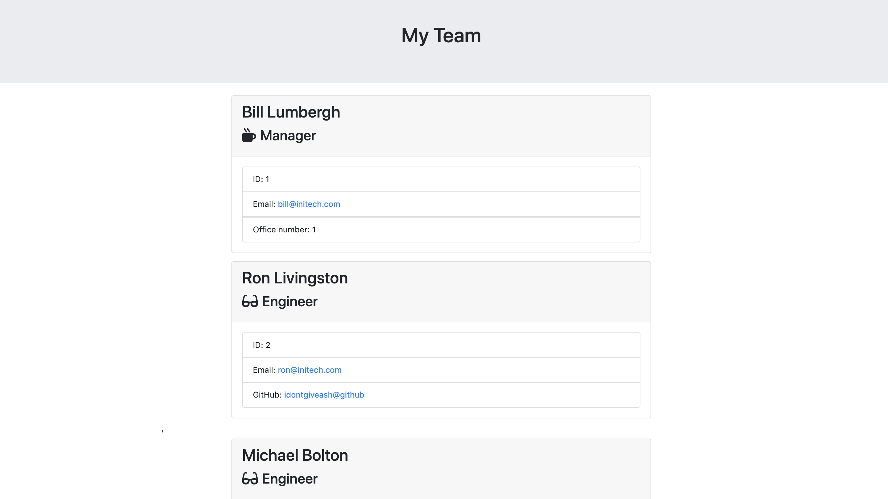

# Project Name: Employee Management Template

## Author: grburner

  

## Table of Contents
<!--ts-->
1. [ Project Description ](#desc)
2. [ Installation Instructions ](#inst)
3. [ Usage Information ](#use)
4. [ Contribution Guidelines ](#guide)
5. [ Test Instructions ](#test)
6. [ License Type ](#l-type)
7. [ Questions | Email me ](#email)

<!--te-->

## 1. Project Description

This is a simple command line interface that takes input about employees on a team (managers, engineers and interns), generates HTML then adds the generated HTML to existing templates.

## 2. Installation Instructions

 Download this source code. Run the app with node app.js

## 3. Usage Information

 The command line will display a series of prompts about your employee team. Answer those prompts and HTML will be generated in the 'output' folder. This file can be run in your browser.

## 4. Contribution Guidelines

 There are many ways to help grow this project: Submit bugs and feature requests. Review source code changes. Help review the documentation. Make pull requests for anything from typos to updated functionality.

## 5. Test Instructions

 Run 'npm test' to test that the classes are functioning properly

## 6. License Type

 Licensed under the [MIT](license/mit.txt) license.

## 7. Questions? Email me @:

[grburner@gmail.com](mailto:grburner@gmail.com) or find me on [GitHub](https://github.com/grburner)
